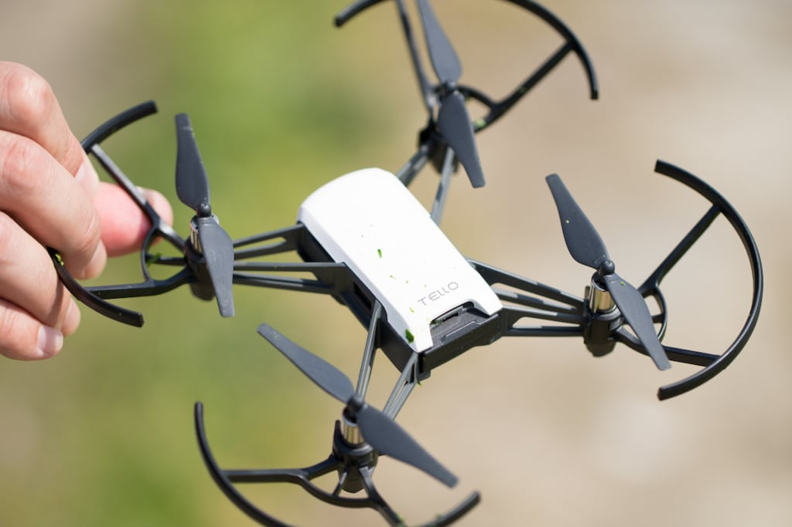
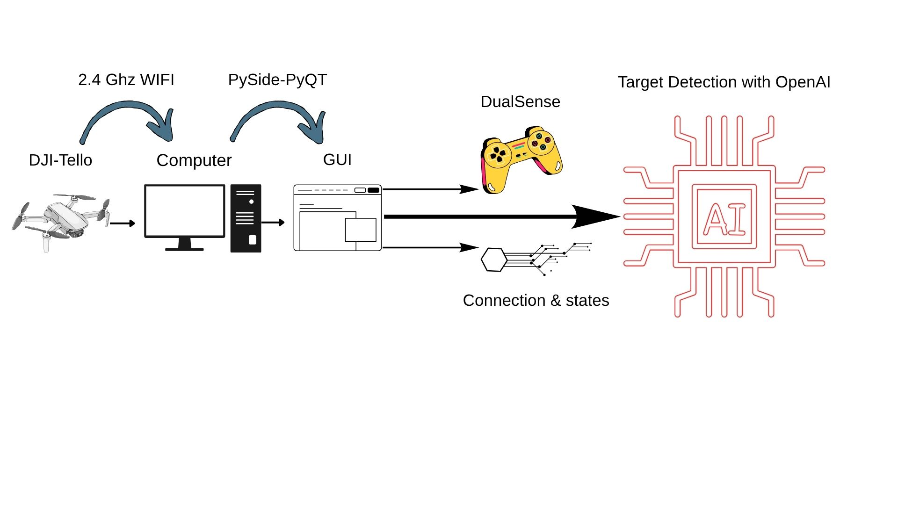

# 🚁 DJI Tello Drone Programming – AI Target Detection (LLM Powered)

<p align="left">
  
</p>

An advanced drone control system with real-time AI-based target detection using OpenAI models.

---

## 🔥 Features

* 🎮 Gamepad-controlled drone navigation
* 📡 Real-time video streaming
* 🤖 AI-powered target detection (LLM-based)
* 🖼️ Custom target image input
* 🧠 Smart detection pipeline (frame encoding + analysis)
* 🖥️ Modern PySide6 GUI
* ⚡ Multi-threaded architecture (QThread workers)

---

## 🧠 System Overview

```
Drone Camera → Frame Capture → Encode → LLM Analysis → UI Feedback
```
<p align="left">
  
</p>

---

## 🖼️ Interface

* Left Panel → Telemetry + Target Selection
* Center → Live Drone Feed
* Right Panel → AI Analysis Module

---

## 🛠️ Tech Stack

* Python
* PySide6 (GUI)
* OpenCV
* OpenAI API
* Multithreading (Qt Threads)


## ⚙️ Setup

```bash
git clone https://github.com/KubilayBildirici/DJI-Tello-Drone-Programming-with-LLM-Entegration.git
cd Tello_Drone

pip install -r requirements.txt
```

---

## 🔐 Environment Variables

Create a `.env` file:

```
OPENAI_API_KEY=your_api_key_here
```

---

## ▶️ Run

```bash
python main_ui.py
```

## Have a FUN !!!

<p align="left">
  
</p>

## 👤 Author

Kubilay Bildirici
